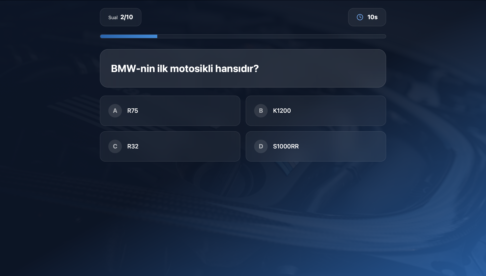
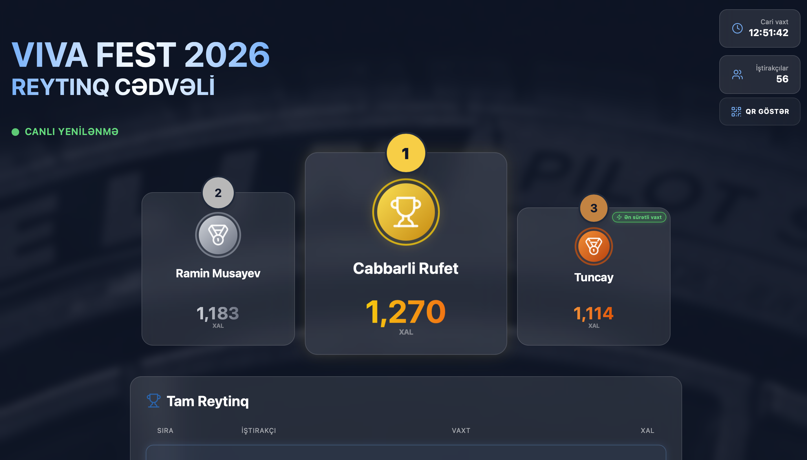
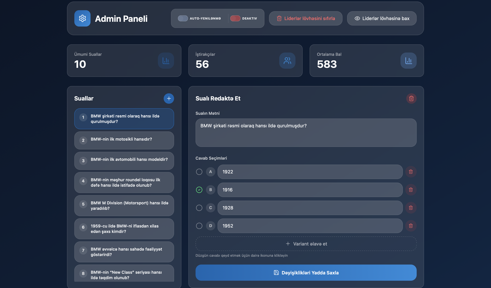

# VIVA FEST 2026 — Quiz & Leaderboard (Frontend)

This repository contains the frontend application for the VIVA FEST 2026 interactive quiz system. The project is designed for high-performance real-time interactions during live events, providing a seamless experience for hundreds of concurrent participants.

## 🚀 Overview
The application is built with **React** and **TypeScript**, focusing on a premium, responsive UI and efficient state management. It connects to the Viva Fest API to handle quiz submissions and live standings updates.

## 🛠 Tech Stack
- **Framework:** React 18 (Vite)
- **Language:** TypeScript
- **Styling:** Tailwind CSS
- **UI Components:** shadcn/ui
- **State Management:** Zustand
- **Icons:** Lucide-React
- **API Client:** Axios

## 📱 Core Modules
- **Participant Quiz Flow:** A fast, intuitive interface with per-question timers and optimized interaction states.
- **Live Leaderboard:** A dynamic standings display with an automated polling mechanism for real-time rank updates on event screens.
- **Admin Dashboard:** A streamlined management interface for real-time question control and leaderboard administration.

## ⚡ Performance & Scalability
The application is optimized for **high-traffic scenarios**. By utilizing lightweight state management and efficient polling strategies, the frontend ensures smooth performance even with a large number of active participants and frequent data updates from the API.

## 📸 Screenshots

### Participant Quiz Interface


### Live Leaderboard


### Admin Dashboard


*(Note: Replace placeholders with actual files in the `/screenshots` folder)*

## 🛠 Getting Started

1. **Install dependencies:**
   ```bash
   npm install
   ```

2. **Configure environment:**
   Create a `.env` file and set your backend URL:
   ```env
   VITE_API_BASE_URL=your_api_endpoint
   ```

3. **Run the project:**
   ```bash
   npm run dev
   ```
```
